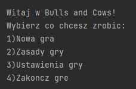
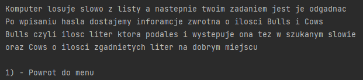
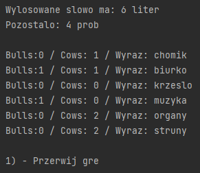
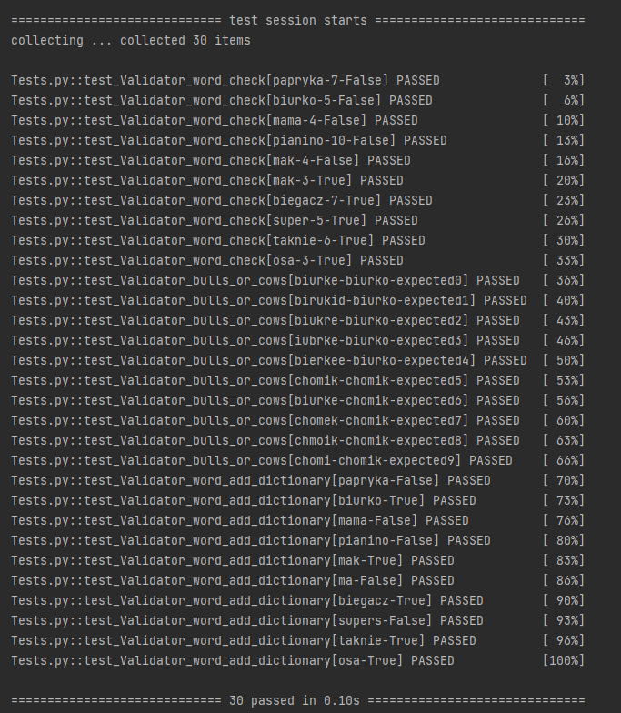

<h1 align="center">Bulls and Cows</h1>

<h4 align="center">A small terminal-based word game</h4>

## Table of contents

* [General info](#bulls_and_cows)
* [Rules](#rules)
* [Features](#features)
* [Tests](#tests)

## Rules
The computer draws a word from the list and then your task is to guess it. After entering the password, we get feedback about the number of Bulls and Cows.
The number of bulls informs about the number of letters in the right place, the number of cows informs about the number of letters in the wrong place.

## Features
At the beginning of the game, user is informed about the number of attempts and the word length

## Tests

